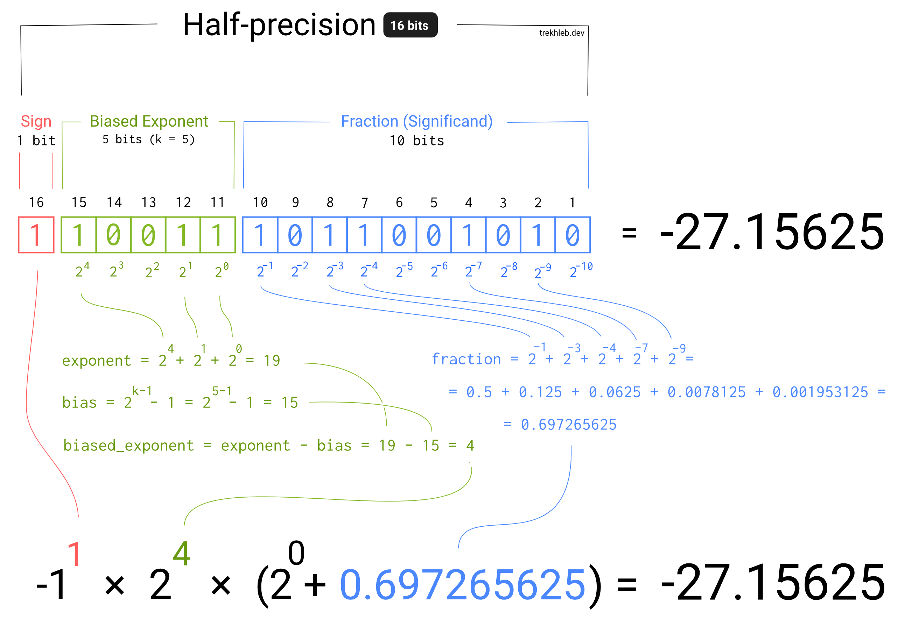

# Binary representation of floating point numbers

| Floating-point format | Total bits | Sign bits | Exponent bits | Significand bits |
| :-------------------- | :--------: | :-------: | :-----------: | :--------------: |
| Half precision        | 16         | 1         | 5             | 10               |
| Single precision      | 32         | 1         | 8             | 23               |
| Double precision      | 64         | 1         | 11            | 52               |

## References

Check out the following resources to get deeper understanding of the binary representation of floating point numbers.

Articles:
- [Here is what you need to know about JavaScript’s Number type](https://indepth.dev/posts/1139/here-is-what-you-need-to-know-about-javascripts-number-type)

Interactive tools:
- [Float Toy](http://evanw.github.io/float-toy/)
- [IEEE754 Visualization](https://bartaz.github.io/ieee754-visualization/)
- [Float Exposed](https://float.exposed/)

Specifications:
- [IEEE Standard for Floating-Point Arithmetic (IEEE 754)](https://en.wikipedia.org/wiki/IEEE_754)
- [Half-precision floating-point format](https://en.wikipedia.org/wiki/Half-precision_floating-point_format)
- [Single-precision floating-point format](https://en.wikipedia.org/wiki/Single-precision_floating-point_format)
- [Double-precision floating-point format](https://en.wikipedia.org/wiki/Double-precision_floating-point_format)
- [Biased exponent](https://en.wikipedia.org/wiki/Exponent_bias)
